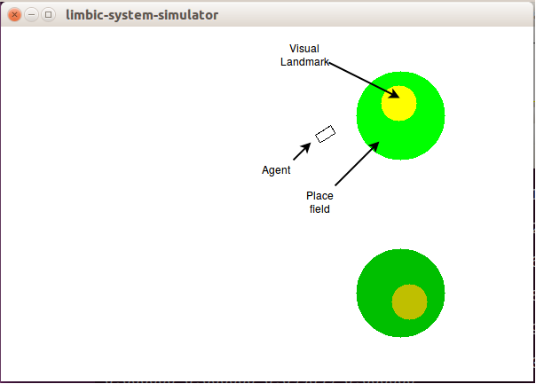

# Limibic system simulator

This is a simple simulator for reward based learning in animals.

## Limbic system model
Ignore anything which is in this directoy and just check out the

subdirectory limbic_system 

which contains the actual connections between the nuclei.

## Stimuli

 * Visual landmark (dark green and bright green objects)
 * Place fields around them
 * Reward signal at the landmark which can be assigned to one of the landmarks
 * Switching of the reward from one landmark to the other

## Motor output
 * Two signals to either approach the dark green landmark or the bright one

## Requires
* QT5
* IIR1 libaray (http://www.berndporr.me.uk/iir/)

## Compile under Linux
* Install the IIR filter library https://github.com/berndporr/iir1 or install it via ppa: "ppa:berndporr/usbdux" and  "apt-get install iir1-dev".
* Install the other packages: "apt-get install qt5-qmake, g++, qtbase5-dev-tools, qtdeclarative5-dev-tools, qtbase5-dev, qt5-default"
* qmake
* make
